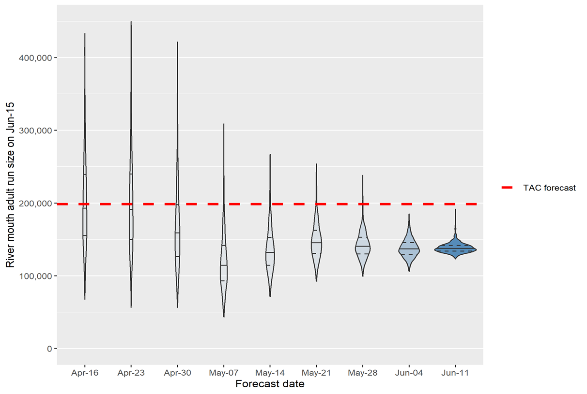
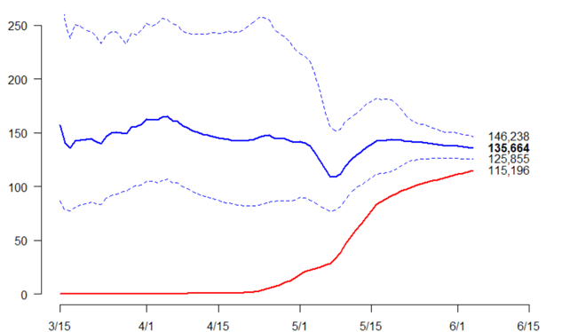

```{r setup, include=FALSE}
# Manually update this value to invalidate the cache
reset_cache <- "v1"

knitr::opts_chunk$set(echo = FALSE, cache.extra = reset_cache)

library(tidyverse)
```

# Overview of system(s) being managed:	US v Oregon (Hannah)

## Management agreement governing salmon harvest by Washington, Oregon and 4 Treaty Tribes

##	Management stocks

-	Spring Chinook, summer Chinook, sockeye, steelhead (H & W * A & B), Fall Chinooks stocks (several)
-	Harvest control rules

# Do you use your results to make management decisions? (Hannah)

##	Pre-season plannings
## In-season management
##	Post-season assessment

# Current approach to forecasting (Mark)

## What data are available/used? 

-	**Response** = run reconstruction output
    - i.e., abundance indices
    - Example: Upriver spring Chinook =   
    Jan 1 – June 15 Bonneville counts + harvest < Bonneville
    - Generally by age
        - Not sure if we always *need* to (Ethan and Michael?)
    
## What data are available/used? 

- **Predictors**
    - Preseason
        - Previous years' abundance
            - Age composition
        - Environmental variables (not currently used much)
    - During season
        -	Dam counts
        -	River flow

## What type of analyses do you conduct? (Mark)
	
- Sibling regression 
    - Dynamic linear models
$$
\small
\left\{\begin{aligned}
\mathrm{log}(y_{a,t}) & =\alpha_t+\mathrm{log}(y_{a-1,t-1}) \beta_t+v_t, & & v_t  \sim \mathcal{N}\left(0, V_t\right) \\
\alpha_t & =\alpha_{t-1}+w_{\alpha, t}, & & w_{\alpha, t} \sim \mathcal{N}\left(0, W_{\alpha, t}\right) \\
\beta_t & =\beta_{t-1}+w_{\beta, t}, & & w_{\beta, t} \sim \mathcal{N}\left(0, W_{\beta, t}\right) 
\end{aligned}\right.
$$
    - Model averaging  
-	Multi-year averages (e.g., 5-year or 10 year)


## What type of analyses do you conduct? (Mark)

- **During season**
    - Average run timing $$\small \text{Bonneville return} = \frac{\text{Bonneville return through day}~d}{\text{Ave. prop. complete through day}~d} $$
    - Integrated model with likelihoods for
       - pre-season sibling regression
       - in-season dam counts and run timing
    - Linear models with jacks and dam counts as predictors

# How good do they do? (forecast accuracy summary or simple statement of current problems) (Mark & Hannah)

##  Chinook preseason MAPE 25--30%
```{r eval=TRUE, message=FALSE, warning=FALSE, cache=TRUE, include=FALSE}
##save your API key in your environmental variables.
###https://cran.r-project.org/web/packages/httr/vignettes/secrets.html
###Talk to Mark or Adam or Aileen if you don't have an API key
api_key<-Sys.getenv("api_key") 

server <- "Production"

packages <- c("tidyr",
                "httr",
                "jsonlite")

  if (!require(install.load)) {
    install.packages("install.load")
  }

  install.load::install_load(packages)

  # Test server: https://usvordev.psmfc.org/
  # Production server: https://usvor.psmfc.org/

  server_prefix<-ifelse(server == "Production", yes = "https://usvor.psmfc.org", no = "https://usvordev.psmfc.org")
  
  url_returns_forecasts <- paste(server_prefix, "/TACAPI/GetReturnsForecast", sep="")
  
   # Connect to returns and forecasts table
  api_returns_forecasts <- 
    GET(url_returns_forecasts, add_headers("APIKey" = api_key)) |> 
    httr::content( type = "application/json") |> 
    purrr::pluck(1) |> 
    (\(x) do.call(rbind, x))() |> 
    as.data.frame() |> 
    unnest(everything())


```

```{r, message=FALSE, warning=FALSE,fig.cap="Black line is the 10-year average absolute prediction error (MAPE)"}

test<-api_returns_forecasts |> filter(ReturnsForecastsStockName %in% c("Upriver Spring Chinook","Upper Columbia Summer Chinook","Upriver Bright (URB) Fall Chinook","Lower River Hatchery (LRH) Fall Chinook")) |> 
  filter(between(Year,2006,2023)) |> 
  select(Year,Stock=ReturnsForecastsStockName,Type=ReturnsForecastsCountTypeName,Count) |> 
  group_by(Year,Stock,Type) |> 
  dplyr::summarize(Count=mean(Count,na.rm=TRUE)) |> 
  pivot_wider(names_from = Type,values_from = Count) |> 
  arrange(Year) |> 
  group_by(Stock) |> 
  mutate(error=Predicted-Actual,
         pct_error=(error/Actual)*100,
         APE=(abs(error)/Actual)*100,
         MAPE=zoo::rollmean(APE,k=10,align="right",na.pad = TRUE))

test |> ungroup() |> 
  mutate(Stock=fct_relevel(Stock,c( "Upriver Spring Chinook"  ,"Upper Columbia Summer Chinook", "Lower River Hatchery (LRH) Fall Chinook", "Upriver Bright (URB) Fall Chinook"))) |> 
  ggplot(aes(x=Year))+geom_bar(aes(,y=pct_error,fill = pct_error > 0),stat = "identity") + scale_fill_manual(values = c("TRUE" = "red", "FALSE" = "black")) +facet_wrap(~Stock)+theme(legend.position = "none",axis.title.x = element_blank())+ylab("Percent error")+geom_line(aes(y=MAPE))


```

## Steelhead preseason MAPE ~50%
```{r, message=FALSE, warning=FALSE,fig.cap="Black line is the 10-year average absolute prediction error (MAPE)"}

test<-api_returns_forecasts |> filter(ReturnsForecastsStockName %in% c("A-Index Summer Steelhead" ,"B-Index Summer Steelhead" )) |> 
  filter(between(Year,2006,2023)) |> 
  select(Year,Stock=ReturnsForecastsStockName,Type=ReturnsForecastsCountTypeName,Count) |> 
  group_by(Year,Stock,Type) |> 
  dplyr::summarize(Count=mean(Count,na.rm=TRUE)) |> 
  pivot_wider(names_from = Type,values_from = Count) |> 
  arrange(Year) |> 
  group_by(Stock) |> 
  mutate(error=Predicted-Actual,
         pct_error=(error/Actual)*100,
         APE=(abs(error)/Actual)*100,
         MAPE=zoo::rollmean(APE,k=10,align="right",na.pad = TRUE))

test |> ungroup() |> 
  mutate(Stock=fct_relevel(Stock,c("A-Index Summer Steelhead" ,"B-Index Summer Steelhead" ))) |> 
  ggplot(aes(x=Year))+geom_bar(aes(,y=pct_error,fill = pct_error > 0),stat = "identity") + scale_fill_manual(values = c("TRUE" = "red", "FALSE" = "black")) +facet_wrap(~Stock)+theme(legend.position = "none",axis.title.x = element_blank())+ylab("Percent error")+geom_line(aes(y=MAPE))

```


## Joint likelihood inseason model

<!--  -->

```{r , out.width='80%',fig.align='center'}
 
#
```  
Violin plots of posterior for River-mouth run sizes. Dashed reference lines are IQR and solid line is median of posterior

## Inseason linear model

<!--  -->

```{r , out.width='100%',fig.align='center'}
 
#
```  

Dashed lines spawn 95% prediction interval. Solid blue line is expected value. Red line is count to date.

# What would most help you in improving future forecasts?

## General challenges (Hannah)

-	Environmental covariates
    -	Which ones?
    -	Matching covariates with habitat use of stock in space and time
        - What do we know about where fish are and when, and what affects their survival
    -	How to incorporate?
        -	Variable selection, regularization, etc. (optional)
        
